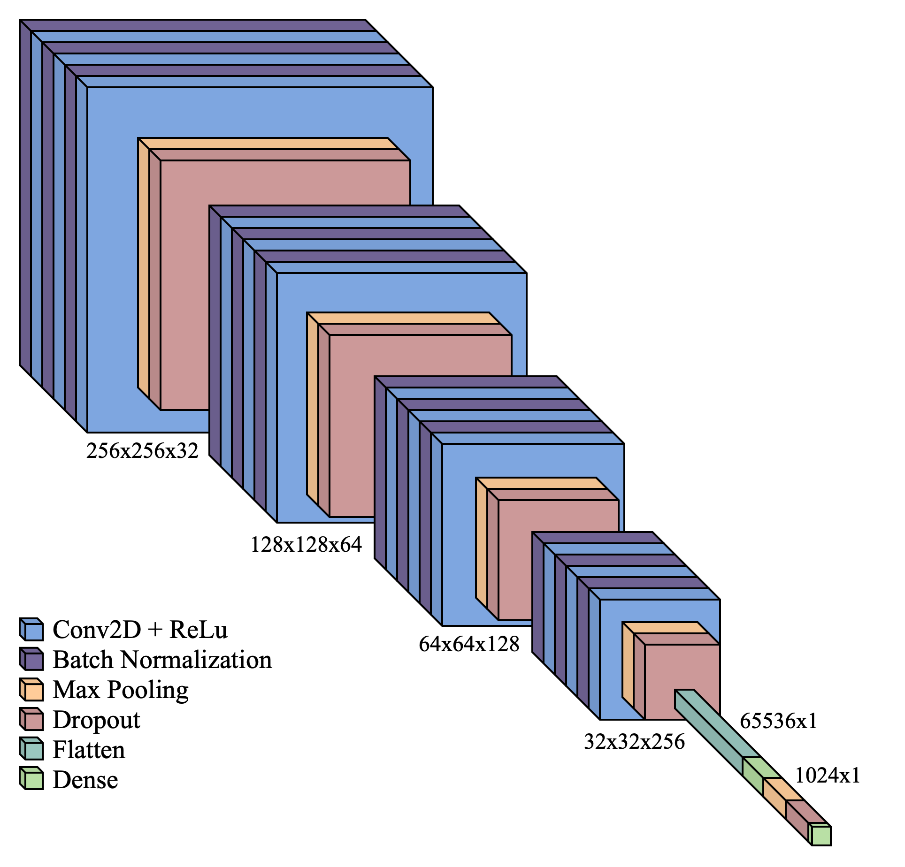

# CNN for age estimation



## References
Please reference the following publications:
<ul>
   <li>Heinrich, A. Accelerating computer vision-based human identification through the integration of deep learning-based age estimation from 2 to 89 years. Sci Rep 14, 4195 (2024). https://doi.org/10.1038/s41598-024-54877-1<br/><br/>Link: https://www.nature.com/articles/s41598-024-54877-1<br/><br/></li>
   <li>follows after acceptance of the publication</li>
</ul>

<br/><br/>
## Download model weight
### very robust model 2 to 89 years
<ul><li>https://www.dropbox.com/scl/fi/b3wkkpd54s0f8ojophm0e/2216_weight.h5?rlkey=ajdu14emfm3ekhtij16lrwz9l&dl=0</li></ul>

### robust model 1 to <25 years
<ul><li>https://www.dropbox.com/scl/fi/u9josnfag2xij90mzcruj/912_weight.h5?rlkey=qnfxjegydl7krgtghwzgghbif&dl=0</li></ul>

<br/><br/>
## Instructions
* Code to apply the model
   
<pre>
```python
import pydicom
import tensorflow as tf
from tensorflow.keras.layers import Input, Conv2D, BatchNormalization, MaxPooling2D, Dropout, Flatten, Dense
from tensorflow.keras.models import Model
from skimage.transform import resize

def get_my_model(learning_rate = 1e-4, d = 0.25):
    # ...
    
def preprocess_dicom_image(file_path):
    return resize(pydicom.read_file(file_path).pixel_array, (256, 256)).reshape(1, 256, 256, 1) 

def estimate_age(model, input_image):
    return model.predict(input_image)[0, 0]

if __name__ == "__main__":

    model_weight = '2216_weight.h5' # very robust model 2 to 89 years
    #model_weight = '912_weight.h5' # robust model 1 to <25 years
    
    dicom_image_path = '...'
    

    model = get_my_model()
    model.load_weights(model_weight)
    
    result = estimate_age(model, preprocess_dicom_image(dicom_image_path))

    if model_weight == '912_weight.h5':
        print(f"Predicted Age: {round(result/365.25,2)} years")
    else:
        print(f"Predicted Age: {result} years")
```
</pre>
